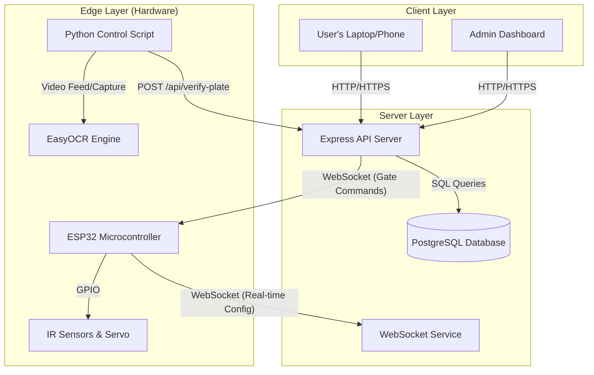
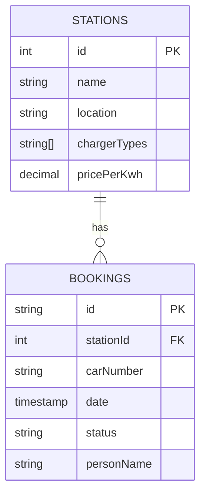
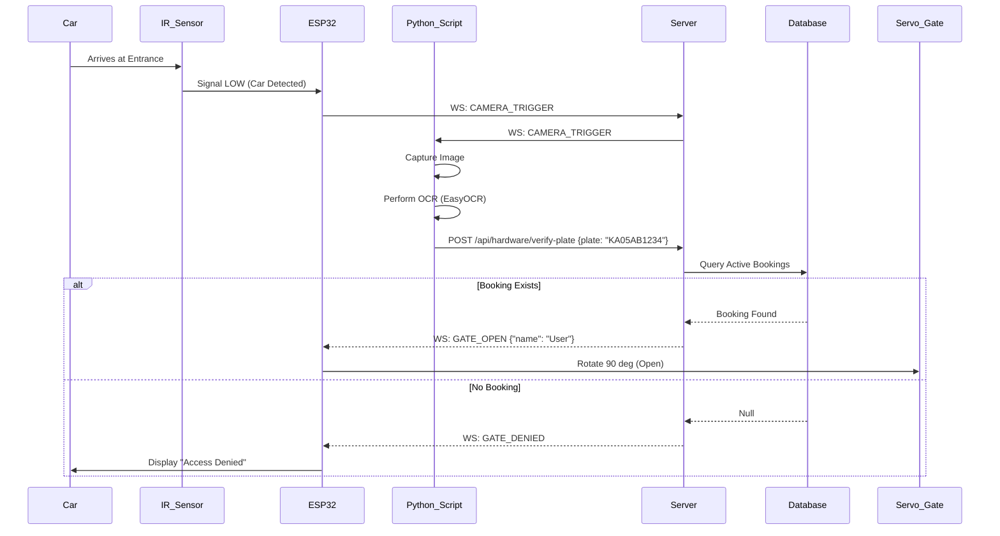

# A PROJECT REPORT ON
# SMART EV CHARGING STATION WITH ALPR

**Submitted in partial fulfillment of the requirements for the degree of**
**BACHELOR OF TECHNOLOGY**

---

## ABSTRACT

The rapid adoption of Electric Vehicles (EVs) has created a pressing need for efficient charging infrastructure. Current public charging stations often suffer from issues like "ICE-ing" (Internal Combustion Engine vehicles blocking slots), lack of real-time availability information, and inefficient manual verification processes.

This project, **"Smart EV Charging Station with ALPR"**, proposes an integrated solution combining a web-based booking platform with hardware-level enforcement. The system utilizes **Automatic License Plate Recognition (ALPR)** to verify vehicle identity at the charging station entrance. Users can book specific time slots via a responsive web application. Upon arrival, a camera captures the vehicle's license plate, processes it using Optical Character Recognition (OCR), and verifies the booking against a central database. If authorized, an IoT-enabled microcontroller (ESP32) triggers the gate to open.

This report details the system's design, including the full-stack web architecture, the computer vision algorithm for Indian license plates, and the embedded hardware logic. The result is a seamless, automated experience that optimizes charging slot utilization and eliminates unauthorized parking.

---

# TABLE OF CONTENTS

1. **Chapter 1: INTRODUCTION**
    - 1.1 Background
    - 1.2 Problem Statement
    - 1.3 Objectives
    - 1.4 Scope of the Project
2. **Chapter 2: LITERATURE SURVEY**
    - 2.1 Existing Charging Infrastructure
    - 2.2 Technologies Used in Similar Systems
3. **Chapter 3: SYSTEM ANALYSIS**
    - 3.1 Proposed System
    - 3.2 Feasibility Study
    - 3.3 Hardware Requirements
    - 3.4 Software Requirements
4. **Chapter 4: SYSTEM DESIGN**
    - 4.1 System Architecture
    - 4.2 Data Flow Diagram (DFD)
    - 4.3 Database Design (ER Diagram)
    - 4.4 Sequence Diagram
5. **Chapter 5: IMPLEMENTATION DETAILS**
    - 5.1 Algorithm: License Plate Recognition
    - 5.2 Hardware Integration (ESP32)
    - 5.3 Web Application Modules
6. **Chapter 6: RESULTS AND SNAPSHOTS**
7. **Chapter 7: CONCLUSION AND FUTURE SCOPE**
8. **REFERENCES**

---

# CHAPTER 1: INTRODUCTION

## 1.1 Background
The global shift towards sustainable transportation has accelerated the production and sale of Electric Vehicles (EVs). However, the infrastructure to support these vehicles, specifically charging stations, has not kept pace. One of the critical challenges is not just the number of chargers, but the management of access to them. Drivers frequently encounter "occupied" chargers that are blocked by non-EVs or EVs that are not charging, leading to "range anxiety" and frustration.

## 1.2 Problem Statement
Existing charging solutions lack a cohesive link between digital booking and physical access. 
1.  **Unauthorized Parking**: Non-EVs often park in charging slots.
2.  **Uncertainty**: Users assume a slot is free based on an app, only to find it physically blocked upon arrival.
3.  **Manual Intervention**: Many private stations require security guards to check bookings manually.

## 1.3 Objectives
The primary objective is to develop a **Smart EV Charging Station Booking System** that:
*   Allows users to view real-time availability and book slots remotely.
*   Automatically verifies the vehicle at the gate using a camera and License Plate Recognition (LPR).
*   Controls physical access (barrier/gate) via an ESP32 microcontroller without human intervention.
*   Provides a dashboard for station admins to monitor usage and overrides.

## 1.4 Scope of the Project
The project covers:
*   **Web Application**: For user registration, station search, and payment-integrated booking.
*   **Computer Vision Module**: Specifically tuned for detecting and reading Indian license plate formats.
*   **IoT Hardware**: Integrating IR sensors for occupancy detection and Servo motors for gate control.

---

# CHAPTER 2: LITERATURE SURVEY

## 2.1 Existing Charging Infrastructure
Currently, most charging networks (like Tata Power, Ionity) operate on a "first-come, first-served" basis or use app-based unlocking where the user must be physically present to unlock the gun. There is rarely a mechanism to prevent a random car from blocking the parking spot itself.

## 2.2 Technologies Used in Similar Systems
*   **RFID Cards**: Common in Europe. Pros: Reliable. Cons: Requires carrying a physical card; no vehicle verification (user can bring a different car).
*   **QR Codes**: Users scan a QR code at the station. Pros: Low cost. Cons: Does not prevent physical blocking of the slot before scanning.
*   **ALPR (Proposed)**: Uses the car's identity itself. Frictionless and prevents unbooked cars from entering.

---

# CHAPTER 3: SYSTEM ANALYSIS

## 3.1 Proposed System
The proposed system integrates the digital and physical realms.
*   **User Side**: Books a slot online. The car number is verified.
*   **Server Side**: A Node.js/Express server manages bookings and exposes APIs for the hardware.
*   **Hardware Side**: A camera continuously scans the entrance. When a car approaches (detected by IR or motion), it snaps a picture. The Python script runs OCR. If the plate matches a booking for the current time window, the ESP32 opens the gate.

## 3.2 Feasibility Study
*   **Technical Feasibility**: The project uses established technologies (React, Node.js, OpenCV). The hardware (ESP32, Webcam) is readily available and supports the required communication protocols (WebSocket/HTTP).
*   **Economic Feasibility**: The cost of a webcam and ESP32 is significantly lower than deploying human security guards or expensive RFID bollards.
*   **Operational Feasibility**: The system is automated, requiring minimal maintenance once installed.

## 3.3 Hardware Requirements
1.  **ESP32 Development Board**: The brain of the hardware operations. Features built-in WiFi and Bluetooth.
2.  **Webcam / USB Camera**: For capturing high-resolution images of license plates.
3.  **IR Sensors (Infrared)**: 4 units.
    *   1 at the Entrance to detect car arrival.
    *   3 at individual charging slots to monitor real-time occupancy.
4.  **Servo Motor**: To simulate the physical barrier/gate.
5.  **LCD Display (16x2 I2C)**: To show status messages ("Welcome", "Access Denied", "Scanning...").
6.  **Jumper Wires & Breadboard**.

## 3.4 Software Requirements
*   **Operating System**: Windows / Linux.
*   **Frontend**: React.js, Vite, Tailwind CSS.
*   **Backend**: Node.js, Express.js.
*   **Database**: PostgreSQL (Neon Serverless).
*   **Computer Vision**: Python 3.x, OpenCV, EasyOCR, PyTorch.
*   **Firmware**: C++ (Arduino IDE for ESP32).

---

# CHAPTER 4: SYSTEM DESIGN

## 4.1 System Architecture

The system follows a modular architecture where the "Edge" (Hardware) communicates with the "Cloud" (Server) via REST APIs and WebSockets.



## 4.2 Data Flow Diagram (Level 1)

1.  **User Registration**: User -> Details -> Database.
2.  **Booking**: User -> Select Slot -> Server -> Checks Availability -> Confirms -> Database.
3.  **Entry**: Car -> Camera -> Image -> OCR -> Text -> Server -> Verify Booking -> Gate Open.

## 4.3 Database Design (ER Diagram)

The database, managed via Drizzle ORM, consists of the following key entities.



*   **Stations**: Stores static data about charging locations (lat/long, amenities).
*   **Bookings**: The core transactional table linking a user/car to a station for a specific time.

## 4.4 Sequence Diagram: Vehicle Entry Logic



---

# CHAPTER 5: IMPLEMENTATION DETAILS

## 5.1 Algorithm: License Plate Recognition
The `camera_script.py` implements a robust pipeline to read plates.

**Step 1: Image Acquisition**
*   OpenCV (`cv2.VideoCapture`) captures a frame from the USB camera.
*   Triggered via WebSocket message from the ESP32 (when IR sensor breaks).

**Step 2: Pre-processing**
To ensure accuracy under different lighting:
*   **Grayscale Conversion**: Reduces noise.
*   **Bilateral Filter**: Smooths images while preserving edges (characters).
*   **CLAHE**: Contrast Limited Adaptive Histogram Equalization to handle shadows.

**Step 3: OCR (Optical Character Recognition)**
*   Uses `EasyOCR` (based on PyTorch).
*   The script attempts recognition on multiple variants of the image (Normal, High Contrast, Thresholded).

**Step 4: Heuristic Cleaning (The "Secret Sauce")**
OCR often confuses `0` with `O`, `8` with `B`, etc. A custom function (`heuristic_clean`) corrects this based on the standard Indian License Plate format (`LL NN LL NNNN`):
*   Example: `KA-05-AB-1234`
*   First 2 chars must be Letters (State Code).
*   Next 2 chars must be Digits (District Code).
*   If OCR reads `KAO5`, the algorithm corrects `O` -> `0` because it expects a digit at that position.

## 5.2 Hardware Integration (ESP32)
The `esp32_firmware.ino` handles real-time control.

*   **Debouncing**: IR sensors can flicker. The code implements software debouncing (`millis()` checks) to prevent false triggers.
*   **WebSockets**: Uses `WebSocketsClient.h` to maintain a persistent connection to the server. This allows instant reaction (Latency < 200ms) compared to polling.
*   **State Machine**:
    *   `IDLE`: Waiting for car.
    *   `SCANNING`: Car detected, waiting for Server response.
    *   `GATE_OPEN`: Servo active, timer running (auto-close after 5s).
    *   `DENIED`: Show error message.

## 5.3 Web Application Modules
The frontend (`/client`) is built with React components:
*   **BookingCard**: Visual selection of time slots.
*   **Dashboard**: Shows "Upcoming" and "Past" bookings using `useQuery` for data fetching.
*   **Admin Panel**: Allows overriding gate controls manually if OCR fails.

---

# CHAPTER 6: RESULTS AND SNAPSHOTS

*(Note to Student: Insert screenshots in these sections for the final report)*

**6.1 Homepage Interface**
> [ Screenshot of the Landing Page showing "Find Stations" map and "How it works" ]

**6.2 Booking Workflow**
> [ Screenshot of the Calendar/Time Slot selection popup ]

**6.3 Hardware Setup**
> [ Photo of the physical setup showing ESP32, Camera, and LCD Display working together ]

**6.4 Success Case (LCD Output)**
> [ Photo of LCD showing "Welcome <User Name>" and "Go to Slot 1" ]

**6.5 Terminal Output (ALPR)**
```text
[INFO] TRIGGER RECEIVED! Starting capture sequence...
[INFO] Attempt 1/3
[SUCCESS] Plate detected: MH12DE1433
[AUTH] ✅ AUTHORIZED! Booking ID: 550e8400-e29b...
```

---

# CHAPTER 7: CONCLUSION AND FUTURE SCOPE

## 7.1 Conclusion
The **Smart EV Charging Station** successfully demonstrates how IoT and Computer Vision can automate infrastructure management. By removing the need for manual checks, the system reduces waiting times and ensures that charging slots are reserved strictly for authorized users. The integration of ALPR provides a seamless "drive-in" experience, while the web platform offers convenience for planning trips.

## 7.2 Future Scope
*   **Billing Integration**: Automatically deduct money from a wallet based on exact kWh consumed (smart meter integration).
*   **Dynamic Pricing**: Increase slot prices during peak hours.
*   **Mobile App**: Develop a React Native mobile app for better location tracking and push notifications.
*   **ANPR Enhancement**: Train a custom YOLO model for better plate detection accuracy in low light/night conditions.

---

# 8. REFERENCES

1.  *OpenCV Documentation*: https://docs.opencv.org/
2.  *EasyOCR GitHub Repository*: https://github.com/JaidedAI/EasyOCR
3.  *React.js Official Documentation*: https://react.dev/
4.  *Espressif ESP32 Technical Reference Manual*.
