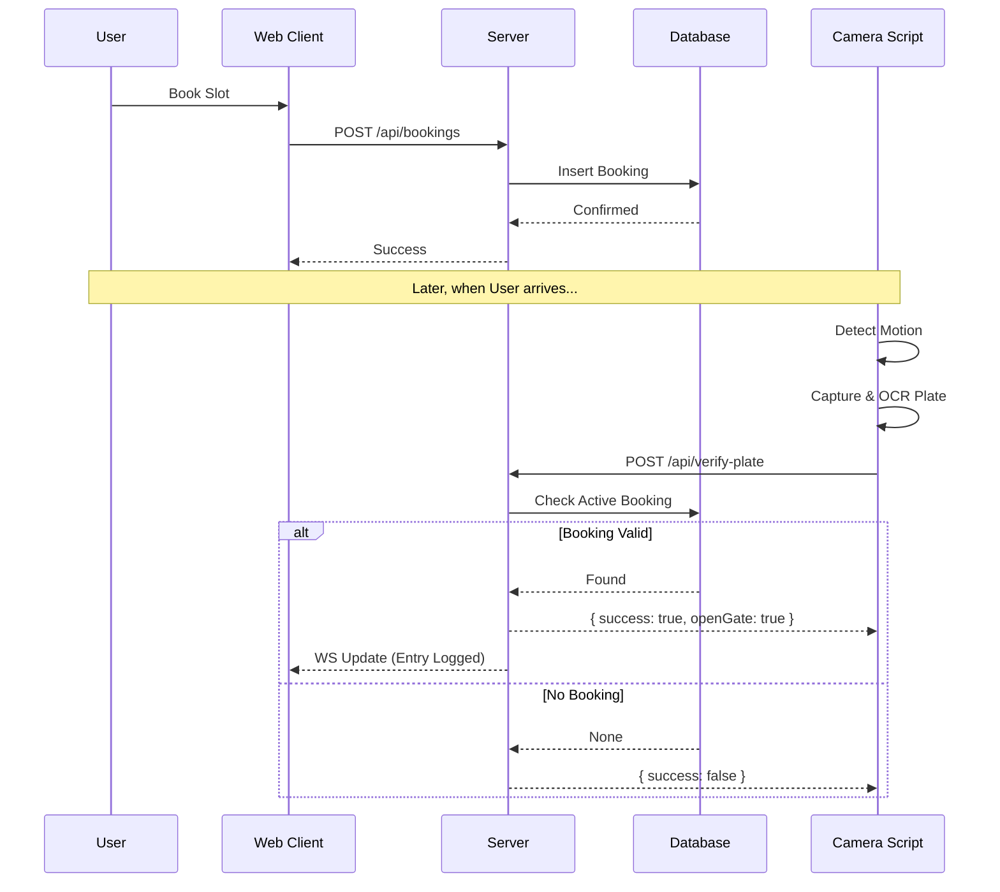

# Project CodeWiki: EV Charging Station Platform

## 1. Project Overview
This project is a full-stack EV Charging Station Booking Platform that integrates web-based booking management with physical hardware (cameras and sensors) for automated access control.

It enables:
- **Users**: To find stations, book slots, and pay online.
- **Admins**: To manage stations and view analytics.
- **Hardware Integration**: Automated license plate recognition (ALPR) to verify bookings and control entry gates.

## 2. System Architecture

The system follows a modular architecture connecting a cloud-based web application with local hardware edge devices.

### High-Level Block Diagram

```mermaid
graph TD
    subgraph "Client Side"
        Browser[Web Browser (React App)]
    end

    subgraph "Server Side"
        API[Express API Server]
        Auth[Passport Auth]
        WS[WebSocket Server]
        DB[(Neon PostgreSQL DB)]
    end

    subgraph "Hardware (Edge)"
        Cam[Camera Script (Python/OCR)]
        ESP[ESP32 Microcontroller]
        Sensors[IR Sensors/Gates]
    end

    Browser <-->|HTTP/REST| API
    Browser <-->|WebSocket| WS
    API <--> input/output DB
    
    Cam -->|HTTP POST (Plate Data)| API
    ESP -->|HTTP POST (Sensor Data)| API
    ESP <-->|GPIO| Sensors
```

### Booking & Entry Flow



## 3. Technology Stack

### Frontend (`/client`)
- **Framework**: React 18 with Vite
- **Language**: TypeScript
- **Styling**: Tailwind CSS + Shadcn UI (Radix Primitives)
- **State/Data**: TanStack Query (React Query)
- **Routing**: Wouter

**Key Directories:**
- `client/src/pages`: Main view components (Home, Bookings, Auth).
- `client/src/components`: Reusable UI components.
- `client/src/hooks`: Custom React hooks (e.g., `use-toast`, `use-mobile`).

### Backend (`/server`)
- **Runtime**: Node.js
- **Framework**: Express.js
- **Database ORM**: Drizzle ORM
- **Database**: PostgreSQL (Neon Serverless)
- **Real-time**: `ws` (WebSockets) for live status updates.

**Key Files:**
- `server/routes.ts`: API route definitions (bookings, users, hardware).
- `server/storage.ts`: Database interface and CRUD operations.
- `server/websocket.ts`: WebSocket server setup for broadcasting hardware events.

### Hardware (`/hardware`)
- **Camera Script** (`camera_script.py`):
    - Python script using `cv2` (OpenCV) and `easyocr`.
    - Detects vehicles, extracts license plate text, and calls the Verify API.
- **Microcontroller** (`esp32_firmware.ino`):
    - C++ firmware for ESP32.
    - Manages IR sensors for slot occupancy and controls physical gates/LEDs.

## 4. Key Workflows

### 4.1. Hardware-to-Server Communication
The hardware components (Camera & ESP32) act as API clients.
1.  **Station ID**: Each hardware unit is configured with a `STATION_ID`.
2.  **API Endpoints**:
    -   `POST /api/hardware/verify-plate`: Sent by Python script to validate a car.
    -   `POST /api/hardware/update-status`: Sent by ESP32 to report slot usage.

### 4.2. Database Schema (Drizzle)
Defined in `shared/schema.ts` (inferred).
-   **Users**: Auth & profiles.
-   **Bookings**: Links Users to Time Slots.
-   **Stations**: Metadata about charging locations.

## 5. Development Setup

### Prerequisites
- Node.js (v20+)
- Python 3.9+ (for hardware script)
- PostgreSQL Database URL

### Running the App
The project uses `concurrently` to run services together.

1.  **Install Dependencies**:
    ```bash
    npm install
    ```
2.  **Start All Services** (Server + Mock Camera):
    ```bash
    npm run dev:all
    ```
    - Starts Express server on port 5000.
    - Starts Vite dev server.
    - Starts Camera script (mock/real mode).

3.  **Database Management**:
    - Push schema changes: `npm run db:push`
